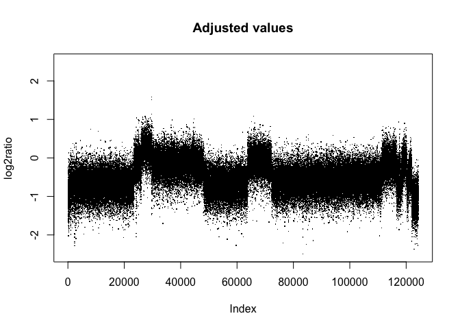
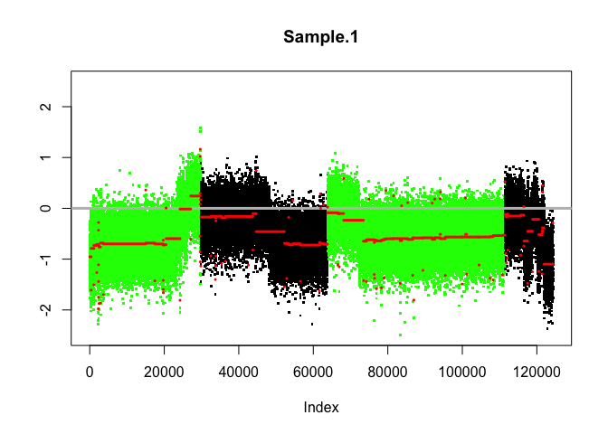
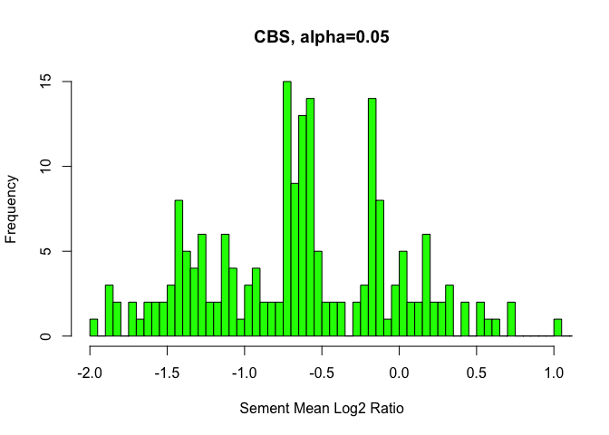

Task 5 - Somatic Copy Number Variant Calling (part 2)
================

``` r
library(DNAcopy)
library(ggplot2)
```

The following R code generates some useful plots of the log2ratio values
(raw and adjusted). The input file is the `SCNA.copynumber.called` file
generated with *VarScan* with the procedure illustrated in the
`task05.md` markdown file.

``` r
folder = "/Users/linda/Desktop/CHG/Project_2022/task05"
cn <- read.table(file.path(folder,"SCNA.copynumber.called"),header=T)


plot(cn$raw_ratio,pch=".",ylim=c(-2.5,2.5),
     ylab="log2ratio",
     main="Raw values")

plot(cn$adjusted_log_ratio,pch=".",ylim=c(-2.5,2.5),
     ylab="log2ratio",
     main="Adjusted values")
```



Create a copy number array (CNA) data object. The function `smooth.CNA`
is needed to detect outliers and smooth the data for circular binary
segmentation (CBS). CBS is performed by the `segment` function, that
segments the log2ratio data in regions with equal copy number.

``` r
set.seed(1)

CNA.object <-CNA(genomdat = cn$adjusted_log_ratio, 
                 chrom = cn$chrom,
                 maploc = cn$chr_start, data.type = 'logratio')

CNA.smoothed <- smooth.CNA(CNA.object)

segs <- segment(CNA.smoothed, 
                min.width = 2, #minimum number of markers for a changed segment
                undo.splits="sdundo", undo.SD = 3, #undoes splits that are not at least this many SDs apart.
                alpha=0.05, #significance levels for the test to accept change-points
                nperm=100,
                verbose=1) #number of permutations used for p-value computation)
```

    ## Analyzing: Sample.1

``` r
#extract the segmentation output
segs2 = segs$output

plot(segs, main="CBS, alpha=0.5", plot.type="w")
```

<!-- -->

Plot with a histogram the distribution of log2\_ratios of all segments
detected with CBS.

``` r
hist(segs2$seg.mean, 
     xlab="Sement Mean Log2 Ratio",
     breaks=80,
     main="CBS, alpha=0.05",
     xlim=c(-2,1),
     col="green")
```

<!-- -->

Find the number of segments compatible with heterozygous deletions:

``` r
het_del_segs <- segs2[which(segs2$seg.mean < (-0.5)
                            & segs2$seg.mean > (-1.5)),]

# Number of segments compatible with heterozygous deletion
nrow(het_del_segs)
```

    ## [1] 101

``` r
# Number of segments in total
nrow(segs2)
```

    ## [1] 175

Write a `.bed` file containing the locations of all segments compatible
with heterozygous deletions

``` r
write.table(het_del_segs[c(2,3,4,1)], file=file.path(folder,"heterozygous.deletions.bed"), 
            row.names=F, col.names=F, quote=F, sep="\t")
```

Write a file `SCNA.copynumber.called.seg`, useful for visualization with
IGV.

``` r
write.table(segs2, file=file.path(folder,"SCNA.copynumber.called.seg"), 
            row.names=F, col.names=T, quote=F, sep="\t")
```
