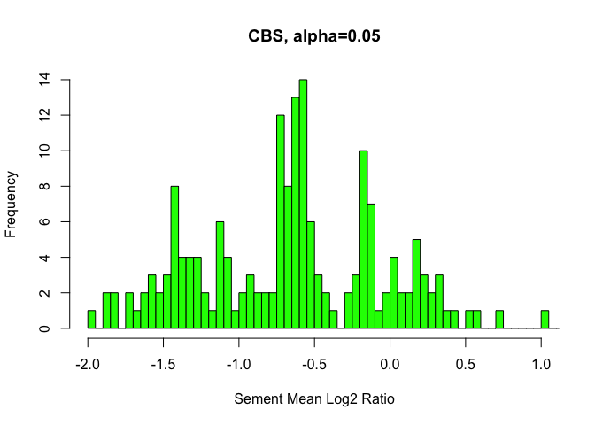

Task 5 - Somatic copy number
================

``` r
library(DNAcopy)
library(ggplot2)
```

The following R code generates some useful plots of the log2ratio values
(raw and adjusted). The input file is the `SCNA.copynumber.called` file
generated with *VarScan*.

``` r
folder = "/Users/linda/Desktop/CHG/Project_2022/task05"
cn <- read.table(file.path(folder,"SCNA.copynumber.called"),header=T)


plot(cn$raw_ratio,pch=".",ylim=c(-2.5,2.5),
     ylab="log2ratio",
     main="Raw values")

plot(cn$adjusted_log_ratio,pch=".",ylim=c(-2.5,2.5),
     ylab="log2ratio",
     main="Adjusted values")
```


Create a copy number array (CNA) data object. The function `smooth.CNA`
is needed to detect outliers and smooth the data for circular binary
segmentation (CBS). CBS is performed by the `segment` function, that
segments the log2ratio data in regions with equal copy number.

``` r
CNA.object <-CNA(genomdat = cn$adjusted_log_ratio, 
                 chrom = cn$chrom,
                 maploc = cn$chr_start, data.type = 'logratio')

CNA.smoothed <- smooth.CNA(CNA.object)

segs <- segment(CNA.smoothed, 
                min.width = 2, #minimum number of markers for a changed segment
                undo.splits="sdundo", undo.SD = 3, #undoes splits that are not at least this many SDs apart.
                alpha=0.05, #significance levels for the test to accept change-points
                nperm=100,
                verbose=1) #number of permutations used for p-value computation)
```

    ## Analyzing: Sample.1

``` r
#extract the segmentation output
segs2 = segs$output

plot(segs, main="CBS, alpha=0.5", plot.type="w")
```

<!-- -->

Plot with a histogram the distribution of log2\_ratios of all segments
detected with CBS.

``` r
hist(segs2$seg.mean, 
     xlab="Sement Mean Log2 Ratio",
     breaks=80,
     main="CBS, alpha=0.05",
     xlim=c(-2,1),
     col="green")
```

<!-- -->

Write a file `SCNA.copynumber.called.seg`, useful for visualization with
IGV.

``` r
write.table(segs2, file=file.path(folder,"SCNA.copynumber.called.seg"), row.names=F, col.names=T, quote=F, sep="\t")
```

## SCNA segments associated with DNA repair genes

Get the positions of the DNA repair genes from the
`DNA_Repair_Genes.bed` file.

``` r
DNA_repair <- read.table("../DNA_Repair_Genes.bed")
colnames(DNA_repair) <- c("chr", "start", "end", "gene")
DNA_repair <- DNA_repair[which(DNA_repair$chr %in% c(15,16,17,18)),]
DNA_repair$chr <- as.integer(DNA_repair$chr)
```

Use the function `getSegments` to associate each gene to its segment and
get the log2R.

``` r
getSegments <- function(genename, chr, initialPos, finalPos, segments=segs2){
  #select segments that intersect initialPos and finalPs
  goodSegs <- segments[which(
    (segments[,2] == chr) & 
      ((segments[,3] >= initialPos & segments[,3] <= finalPos ) |
         (segments[,4] >= initialPos & segments[,4] <= finalPos ) |
         (segments[,3] <= initialPos & segments[,4] >= finalPos ) )),]
  return(cbind(genename, goodSegs))
}
```

``` r
DNA_repair_segments <- mapply(getSegments, DNA_repair$gene, DNA_repair$chr, DNA_repair$start, DNA_repair$end)

DNA_repair_log2R <- as.data.frame(t(as.data.frame(DNA_repair_segments[7,])))
colnames(DNA_repair_log2R) <- "mean_log2R"
DNA_repair_log2R["DNA_repair_gene"] <- rownames(DNA_repair_log2R)

ggplot(data=DNA_repair_log2R, aes(x=DNA_repair_gene, y=mean_log2R))+
  geom_bar(stat="identity", fill = "#31cb00")+
  theme(axis.text.x = element_text(angle=45, hjust=1, vjust=1, 
                                   colour="black"))
```

<!-- -->
