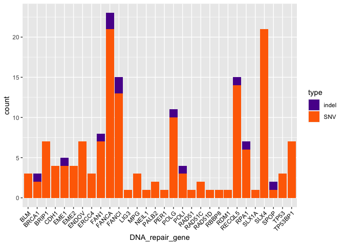

Task 7 - 8
================

``` r
library(ggplot2)
```

## SCNA segments associated with DNA repair genes

Get the positions of the DNA repair genes from the
`DNA_Repair_Genes.bed` file and the segmentation from the
`SCNA.copynumber.called.seg` file.

``` r
DNA_repair <- read.table("../DNA_Repair_Genes.bed")
colnames(DNA_repair) <- c("chr", "start", "end", "gene")
DNA_repair <- DNA_repair[which(DNA_repair$chr %in% c(15,16,17,18)),]
DNA_repair$chr <- as.integer(DNA_repair$chr)

segs <- read.table("../task05/SCNA.copynumber.called.seg", header = 1)
```

The function `getSegments` to associates each gene to its segment and
get the log2R.

``` r
getSegments <- function(genename, chr, initialPos, finalPos, segments=segs){
  #select segments that intersect initialPos and finalPs
  goodSegs <- segments[which(
    (segments[,2] == chr)
    & ((segments[,3] >= initialPos & segments[,3] <= finalPos )
       | (segments[,4] >= initialPos & segments[,4] <= finalPos )
       | (segments[,3] <= initialPos & segments[,4] >= finalPos ) )),]
  return(cbind(genename, goodSegs))
}
```

Select the genes intersecting with a segment with mean log2 ratio
compatible with heterozygous deletions.

``` r
DNA_repair_segments <- mapply(getSegments, DNA_repair$gene, DNA_repair$chr, DNA_repair$start, DNA_repair$end)

DNA_repair_log2R <- as.data.frame(t(as.data.frame(DNA_repair_segments[7,])))
colnames(DNA_repair_log2R) <- "mean_log2R"
DNA_repair_log2R["DNA_repair_gene"] <- rownames(DNA_repair_log2R)

DNA_repair_log2R["Het_deletion"] <- factor("NO", levels = c("YES", "NO"))
DNA_repair_log2R$Het_deletion[which(DNA_repair_log2R$mean_log2R < (-0.5)
                               & DNA_repair_log2R$mean_log2R > (-1))] <- "YES"
```

Plot the mean log 2 ratio of the segments containing a DNA repair gene
and filter the ones compatible with heterozygous deletions

``` r
ggplot(data=DNA_repair_log2R, aes(x=DNA_repair_gene, y=mean_log2R, fill=Het_deletion))+
  geom_bar(stat="identity")+
  theme(axis.text.x = element_text(angle=45, hjust=1, vjust=1, 
                                   colour="black"))+
  scale_fill_manual(values=c("#31cb00", "#ef233c"))
```

<!-- -->

Extract the genes overlapping with deletions

``` r
het_deleted_genes <- DNA_repair_log2R$DNA_repair_gene[which(DNA_repair_log2R$Het_deletion=="YES")]
```

## Task 7 - DNA repair genes that overlap both heterozygous deletions and germline heterozygous SNPs of the patient that are in Clinvar

The only SNP of the patient that is in Clinvar and overlaps with a DNA
repair gene is found in **BRCA1**, which is also one of the DNA repair
genes overlapping with heterozygous deletions.

## Task 8 - Determine which DNA repair genes overlap both heterozygous deletions and somatic point mutations of the patient

Load the DNA repair genes overlapping with somatic SNVs and indels:

``` r
somatic_indel <- read.table("somatic_indel_overlap.tsv")
colnames(somatic_indel) <- c("count", "DNA_repair_gene")
somatic_indel$type <- "indel"

somatic_pm <- read.table("somatic_pm_overlap.tsv")
colnames(somatic_pm) <- c("count", "DNA_repair_gene")
somatic_pm$type <- "SNV"

somatic_overlap <- rbind(somatic_indel, somatic_pm)
```

Plot the number of somatic SNVs and indels overlapping with DNA repair
genes

``` r
ggplot(data=somatic_overlap, aes(x=DNA_repair_gene, y=count, fill=type))+
  geom_bar(stat="identity")+
  theme(axis.text.x = element_text(angle=45, hjust=1, vjust=1, 
                                   colour="black"))+
  # ggtitle("Number of somatic SNVs and indels overlapping with DNA repair genes")+
  scale_fill_manual(values = c("#5a189a", "#ff6d00"))
```

<!-- -->

Find which DNA repair genes presenting germline SNPs also overlaps with
an heteroxygous deletion

``` r
somatic_deletion_overlap <- somatic_overlap$DNA_repair_gene[which(somatic_overlap$DNA_repair_gene
                                                                  %in% het_deleted_genes)]

somatic_deletion_overlap
```

    ## [1] "ENDOV"  "BRCA1"  "RAD51C"
