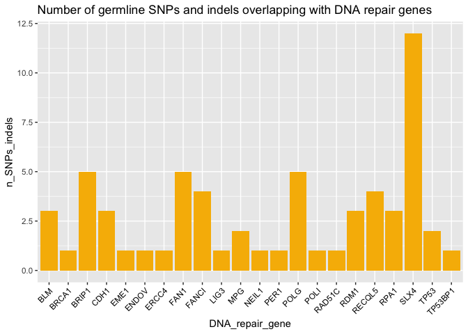
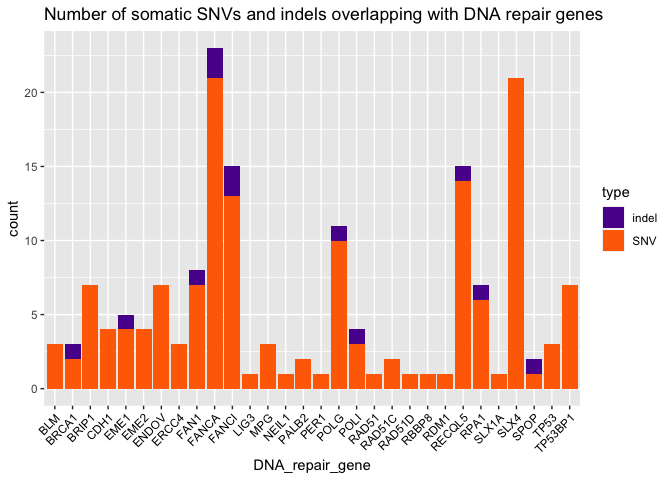

Task 7 - 8
================

``` r
library(ggplot2)
```

## Task 7 - DNA repair genes that overlap both heterozygous deletions and heterozygous SNPs of the patient that are in Clinvar

``` r
germline_overlap <- read.table("overlap_germline.tsv")
colnames(germline_overlap) <- c("n_SNPs_indels", "DNA_repair_gene")
```

``` r
ggplot(data=germline_overlap, aes(x=DNA_repair_gene, y=n_SNPs_indels))+
  geom_bar(stat="identity", fill="#f7b801")+
    theme(axis.text.x = element_text(angle=45, hjust=1, vjust=1, 
                                   colour="black"))+
  ggtitle("Number of germline SNPs and indels overlapping with DNA repair genes")
```

<!-- -->

## Task 8 - Determine which DNA repair genes overlap both heterozygous deletions and somatic point mutations of the patient

``` r
somatic_indel <- read.table("somatic_indel_overlap.tsv")
colnames(somatic_indel) <- c("count", "DNA_repair_gene")
somatic_indel$type <- "indel"

somatic_pm <- read.table("somatic_pm_overlap.tsv")
colnames(somatic_pm) <- c("count", "DNA_repair_gene")
somatic_pm$type <- "SNV"

somatic_overlap <- rbind(somatic_indel, somatic_pm)
```

``` r
ggplot(data=somatic_overlap, aes(x=DNA_repair_gene, y=count, fill=type))+
  geom_bar(stat="identity")+
  theme(axis.text.x = element_text(angle=45, hjust=1, vjust=1, 
                                   colour="black"))+
  ggtitle("Number of somatic SNVs and indels overlapping with DNA repair genes")+
  scale_fill_manual(values = c("#5a189a", "#ff6d00"))
```

<!-- -->
