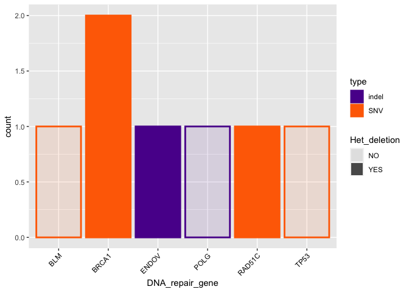

Task 7 - 8
================

``` r
library(ggplot2)
```

## SCNA segments associated with DNA repair genes

Get the positions of the DNA repair genes from the
`DNA_Repair_Genes.bed` file and the segmentation from the
`SCNA.copynumber.called.seg` file.

``` r
DNA_repair <- read.table("../DNA_Repair_Genes.bed")
colnames(DNA_repair) <- c("chr", "start", "end", "gene")
DNA_repair <- DNA_repair[which(DNA_repair$chr %in% c(15,16,17,18)),]
DNA_repair$chr <- as.integer(DNA_repair$chr)

segs <- read.table("../task05/SCNA.copynumber.called.seg", header = 1)
```

Use the function `getSegments` to associate each gene to its segment and
get the log2R.

``` r
getSegments <- function(genename, chr, initialPos, finalPos, segments=segs){
  #select segments that intersect initialPos and finalPs
  goodSegs <- segments[which(
    (segments[,2] == chr) & 
      ((segments[,3] >= initialPos & segments[,3] <= finalPos ) |
         (segments[,4] >= initialPos & segments[,4] <= finalPos ) |
         (segments[,3] <= initialPos & segments[,4] >= finalPos ) )),]
  return(cbind(genename, goodSegs))
}
```

``` r
DNA_repair_segments <- mapply(getSegments, DNA_repair$gene, DNA_repair$chr, DNA_repair$start, DNA_repair$end)

DNA_repair_log2R <- as.data.frame(t(as.data.frame(DNA_repair_segments[7,])))
colnames(DNA_repair_log2R) <- "mean_log2R"
DNA_repair_log2R["DNA_repair_gene"] <- rownames(DNA_repair_log2R)

ggplot(data=DNA_repair_log2R, aes(x=DNA_repair_gene, y=mean_log2R))+
  geom_bar(stat="identity", fill = "#31cb00")+
  theme(axis.text.x = element_text(angle=45, hjust=1, vjust=1, 
                                   colour="black"))
```

<!-- -->

## Task 7 - DNA repair genes that overlap both heterozygous deletions and heterozygous SNPs of the patient that are in Clinvar

``` r
germline_overlap <- read.table("overlap_germline.tsv")
colnames(germline_overlap) <- c("n_SNPs_indels", "DNA_repair_gene")
```

``` r
ggplot(data=germline_overlap, aes(x=DNA_repair_gene, y=n_SNPs_indels))+
  geom_bar(stat="identity", fill="#f7b801")+
    theme(axis.text.x = element_text(angle=45, hjust=1, vjust=1, 
                                   colour="black"))
```

<!-- -->

``` r
  # ggtitle("Number of germline SNPs and indels overlapping with DNA repair genes")
```

## Task 8 - Determine which DNA repair genes overlap both heterozygous deletions and somatic point mutations of the patient

``` r
somatic_indel <- read.table("somatic_indel_overlap.tsv")
colnames(somatic_indel) <- c("count", "DNA_repair_gene")
somatic_indel$type <- "indel"

somatic_pm <- read.table("somatic_pm_overlap.tsv")
colnames(somatic_pm) <- c("count", "DNA_repair_gene")
somatic_pm$type <- "SNV"

somatic_overlap <- rbind(somatic_indel, somatic_pm)
```

``` r
ggplot(data=somatic_overlap, aes(x=DNA_repair_gene, y=count, fill=type))+
  geom_bar(stat="identity")+
  theme(axis.text.x = element_text(angle=45, hjust=1, vjust=1, 
                                   colour="black"))+
  # ggtitle("Number of somatic SNVs and indels overlapping with DNA repair genes")+
  scale_fill_manual(values = c("#5a189a", "#ff6d00"))
```

<!-- -->
