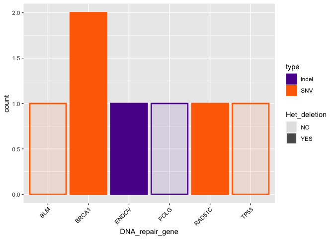

Task 7 - 8
================

``` r
library(ggplot2)
```

## SCNA segments associated with DNA repair genes

Get the positions of the DNA repair genes from the
`DNA_Repair_Genes.bed` file and the segmentation from the
`SCNA.copynumber.called.seg` file created with the procedure described
in `task05_R.md`.

``` r
DNA_repair <- read.table("../DNA_Repair_Genes.bed")
colnames(DNA_repair) <- c("chr", "start", "end", "gene")
DNA_repair <- DNA_repair[which(DNA_repair$chr %in% c(15,16,17,18)),]
DNA_repair$chr <- as.integer(DNA_repair$chr)

segs <- read.table("../task05/SCNA.copynumber.called.seg", header = 1)
```

The function `getSegments` associates DNA repair genes to the segment
they overlap with and gets the log2R.

``` r
getSegments <- function(genename, chr, initialPos, finalPos, segments=segs){
  #select segments that intersect initialPos and finalPs
  goodSegs <- segments[which(
    (segments[,2] == chr)
    & ((segments[,3] >= initialPos & segments[,3] <= finalPos )
       | (segments[,4] >= initialPos & segments[,4] <= finalPos )
       | (segments[,3] <= initialPos & segments[,4] >= finalPos ) )),]
  return(cbind(genename, goodSegs))
}
```

Select the genes intersecting with a segment with mean log2 ratio
compatible with heterozygous deletions.

``` r
DNA_repair_segments <- mapply(getSegments, DNA_repair$gene, DNA_repair$chr, DNA_repair$start, DNA_repair$end)

DNA_repair_log2R <- as.data.frame(t(as.data.frame(DNA_repair_segments[7,])))
colnames(DNA_repair_log2R) <- "mean_log2R"
DNA_repair_log2R["DNA_repair_gene"] <- rownames(DNA_repair_log2R)

DNA_repair_log2R["Het_deletion"] <- factor("NO", levels = c("YES", "NO"))
DNA_repair_log2R$Het_deletion[which(DNA_repair_log2R$mean_log2R < (-0.5)
                               & DNA_repair_log2R$mean_log2R > (-1.5))] <- "YES"
```

Plot the mean log 2 ratio of the segments containing a DNA repair gene
and filter the ones compatible with heterozygous deletions

``` r
ggplot(data=DNA_repair_log2R, aes(x=DNA_repair_gene, y=mean_log2R, fill=Het_deletion))+
  geom_bar(stat="identity")+
  theme(axis.text.x = element_text(angle=45, hjust=1, vjust=1, 
                                   colour="black"))+
  scale_fill_manual(values=c("#31cb00", "#ef233c"))
```

<!-- -->

Extract the genes overlapping with deletions. These genes will be used
to perform an intersection with the lists of genes containing germline
and somatic point mutations generated by the scripts
`task07_ALTERNATIVE` (germline) and `task08_ALTERNATIVE` (somatic).

``` r
het_deleted_genes <- DNA_repair_log2R$DNA_repair_gene[which(DNA_repair_log2R$Het_deletion=="YES")]
```

**Task 7** requires to identify DNA repair genes overlapping with
germline point mutations that are in CLINVAR and heterozygous deletions.
Let’s check if *BRCA1*, the only gene presenting pathogenic SNPs, also
presents a heterozygous deletion.

``` r
"BRCA1" %in% het_deleted_genes
```

    ## [1] TRUE

## DNA repair genes that overlap both heterozygous deletions and germline heterozygous SNPs and indels

Load the DNA repair genes that overlap with germline SNPs (not just the
ones from CLINVAR) and with heterozygous deletions, the file was
obtained with *bedtools* as described in the file `task07_ALTERNATIVE`.

``` r
germline_overlap <- read.table("snps_hemidel_dna_repair.txt")
colnames(germline_overlap) <- c("n_SNPs_indels", "DNA_repair_gene")
```

Plot the number of germline SNPs and indels overlapping with DNA repair
genes that are hemideleted.

``` r
ggplot(data=germline_overlap, aes(x=DNA_repair_gene, y=n_SNPs_indels))+
  geom_bar(stat="identity", fill="#f7b801")+
    theme(axis.text.x = element_text(angle=45, hjust=1, vjust=1, 
                                   colour="black"))
```

<!-- -->

``` r
  # ggtitle("Number of germline SNPs and indels overlapping with DNA repair genes")
```

## Task 8 - Determine which DNA repair genes overlap both heterozygous deletions and somatic point mutations of the patient

Load the DNA repair genes overlapping with somatic SNVs and indels
(obtained with `task08_ALTERNATIVE`:

``` r
somatic_indel <- read.table("somatic_indel_overlap.tsv")
colnames(somatic_indel) <- c("count", "DNA_repair_gene")
somatic_indel$type <- "indel"

somatic_pm <- read.table("somatic_pm_overlap.tsv")
colnames(somatic_pm) <- c("count", "DNA_repair_gene")
somatic_pm$type <- "SNV"

somatic_overlap <- rbind(somatic_indel, somatic_pm)
```

Plot the number of somatic SNVs and indels overlapping with DNA repair
genes

``` r
somatic_overlap$Het_deletion <- factor("NO", levels = c("NO", "YES"))
somatic_overlap$Het_deletion[which(somatic_overlap$DNA_repair_gene 
                                    %in% het_deleted_genes)] <- "YES"

ggplot(data=somatic_overlap, 
       aes(x=DNA_repair_gene, y=count, fill=type, alpha=Het_deletion, col=type))+
  geom_bar(stat="identity", size=1)+
  theme(axis.text.x = element_text(angle=45, hjust=1, vjust=1, 
                                   colour="black"))+
  scale_fill_manual(values = c("#5a189a", "#ff6d00"))+
  scale_color_manual(values = c("#5a189a", "#ff6d00"))
```

<!-- -->

Find which DNA repair genes presenting germline SNPs also overlaps with
an heteroxygous deletion

``` r
somatic_deletion_overlap <- somatic_overlap$DNA_repair_gene[which(somatic_overlap$Het_deletion=="YES")]

somatic_deletion_overlap
```

    ## [1] "ENDOV"  "BRCA1"  "RAD51C"
