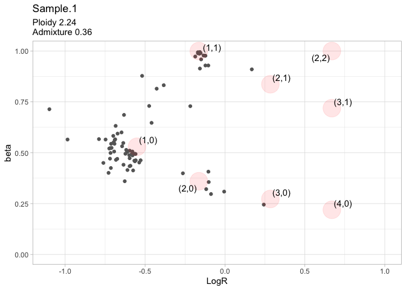

Task 9 - Purity and Ploidy estimation
================

*GATK ASEReadCounter* calculates read counts per allele for
allele-specific expression analysis of RNAseq (??) data. The `.vcf` file
is needed to specify the positions to evaluate: in this case, the
variants identified during task 3 on the control sample. Only biallelic
heterozygous SNPs are considered, so it is quicker to extract them
before with:

``` bash
grep -E "(^#|0/1)" Control.UniGen.vcf > ./task09/control.het.vcf
```

ASEReadCounter was run with the following setup:

``` bash
gatk3 -T ASEReadCounter \
-R human_g1k_v37.fasta \
-o ./task09/control.csv \
-I Control.sorted.dedup.realigned.recal.bam \
-sites ./task09/control.het.vcf  \
-U ALLOW_N_CIGAR_READS \
-minDepth 20 \
--minMappingQuality 20 \
--minBaseQuality 20
```

Parameters explanation: \* `-U ALLOW_N_CIGAR_READS`: allows the `N`
string in CIGAR (it is required for RNASeq so I do not know why it is
here, it is used in lesson 10 of the lab) \* `-MinDepth`: minimum number
of bases that pass filters \* `--minMappingQuality`: minimum read
mapping quality \* `--minBaseQuality`: minimum base quality

Same for the tumor sample:

``` bash
gatk3 ASEReadCounter \
-R human_g1k_v37.fasta \
-o ./task09/tumor.csv \
-I Tumor.sorted.dedup.realigned.recal.bam \
-sites ./task09/control.het.vcf  \
-U ALLOW_N_CIGAR_READS \
-minDepth 20 \
--minMappingQuality 20 \
--minBaseQuality 20
```

## CLONET: CLONality Estimate in Tumors

``` r
library(data.table)
library(CLONETv2)
library(TPES)
```

Load the csv files with the counts per allele for the SNPs and prepare
the pileup tables. The file with the copy-number segmentations created
during task 5 is also needed.

``` r
# Load the allele counts tables
control = fread("control.csv",data.table=F)
control$af = control$altCount/control$totalCount
tumor = fread("tumor.csv",data.table=F)
tumor$af = tumor$altCount/tumor$totalCount

pileup.control = control[c(1,2,4,5,14,8)]
colnames(pileup.control) = c("chr","pos","ref","alt","af","cov")

pileup.tumor = tumor[,c(1,2,4,5,14,8)]
colnames(pileup.tumor) = c("chr","pos","ref","alt","af","cov")

# Load the segmentation file
seg <- fread("../task05/SCNA.copynumber.called.seg",data.table=F)
```

Compute ploidy table with default parameters

``` r
bt <- compute_beta_table(seg, pileup.tumor, pileup.control)

pl.table <- compute_ploidy(bt)

adm.table <- compute_dna_admixture(beta_table = bt, ploidy_table = pl.table)

allele_specific_cna_table <- compute_allele_specific_scna_table(beta_table = bt,
                                                                ploidy_table = pl.table, 
                                                                admixture_table = adm.table)


check.plot <- check_ploidy_and_admixture(beta_table = bt, ploidy_table = pl.table,
                                         admixture_table = adm.table)
```

``` r
print(check.plot)
```

<!-- -->

## TPES

``` r
# snv.reads = fread("../08_SomaticVariantCalling/Data/somatic.pm",data.table=F)
# snv.reads = snv.reads[which(snv.reads$somatic_status=="Somatic"),]
# snv.reads = snv.reads[,c("chrom","position","position","tumor_reads1","tumor_reads2")]
# colnames(snv.reads) = c("chr","start","end","ref.count","alt.count")
# snv.reads$sample = "Sample.1"
# 
# TPES_purity(ID = "Sample.1", SEGfile = seg.tb,
#             SNVsReadCountsFile = snv.reads,
#             ploidy = pl.table,
#             RMB = 0.47, maxAF = 0.6, minCov = 10, minAltReads = 10, minSNVs = 1)
# 
# TPES_report(ID = "Sample.1", SEGfile = seg.tb,
#             SNVsReadCountsFile = snv.reads,
#             ploidy = pl.table,
#             RMB = 0.47, maxAF = 0.6, minCov = 10, minAltReads = 10, minSNVs = 1)
```
