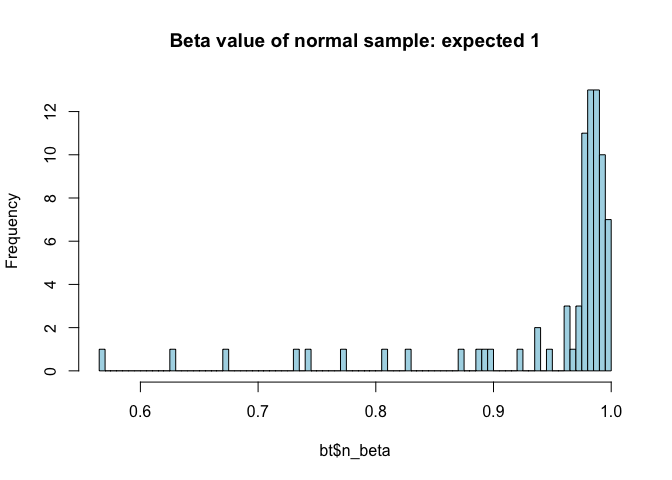
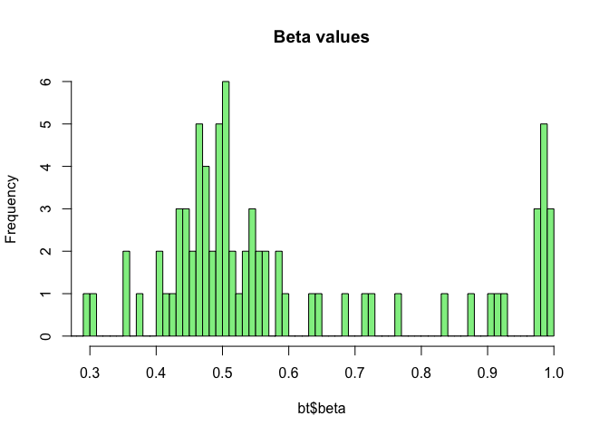
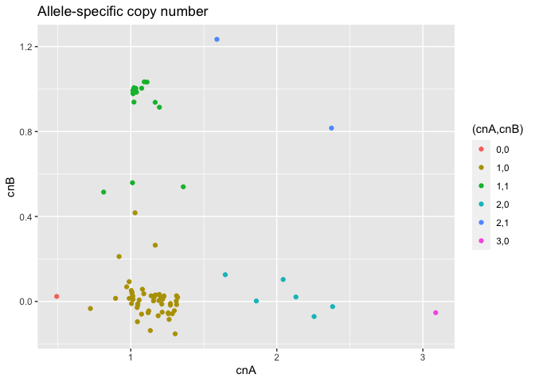
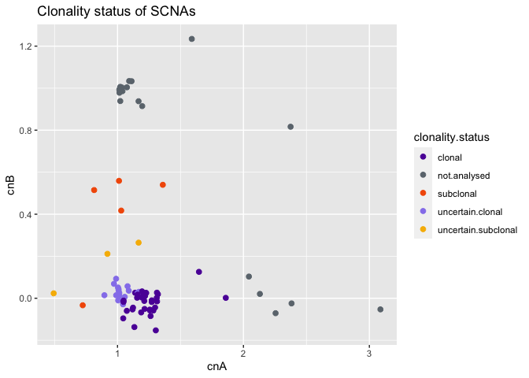

Task 9 - Purity and Ploidy estimation
================

*GATK ASEReadCounter* calculates read counts per allele for
allele-specific expression analysis of RNAseq (??) data. The `.vcf` file
is needed to specify the positions to evaluate: in this case, the SNPs
identified during task 3 on the control sample. Only biallelic
heterozygous SNPs are considered, so it is quicker to extract them
before with:

``` bash
grep -E "(^#|0/1)" Control.UniGen.vcf > ./task09/control.het.vcf
```

ASEReadCounter was run with the following setup:

``` bash
gatk3 -T ASEReadCounter \
-R human_g1k_v37.fasta \
-o ./task09/control.csv \
-I Control.sorted.dedup.realigned.recal.bam \
-sites ./task09/control.het.vcf  \
-U ALLOW_N_CIGAR_READS \
-minDepth 20 \
--minMappingQuality 20 \
--minBaseQuality 20
```

Parameters explanation: \* `-U ALLOW_N_CIGAR_READS`: allows the `N`
string in CIGAR (it is required for RNASeq so I do not know why it is
here, it is used in lesson 10 of the lab) \* `-MinDepth`: minimum number
of bases that pass filters \* `--minMappingQuality`: minimum read
mapping quality \* `--minBaseQuality`: minimum base quality

Same for the tumor sample:

``` bash
gatk3 ASEReadCounter \
-R human_g1k_v37.fasta \
-o ./task09/tumor.csv \
-I Tumor.sorted.dedup.realigned.recal.bam \
-sites ./task09/control.het.vcf  \
-U ALLOW_N_CIGAR_READS \
-minDepth 20 \
--minMappingQuality 20 \
--minBaseQuality 20
```

## CLONET: CLONality Estimate in Tumors

[CLONETv2 paper](https://www.ncbi.nlm.nih.gov/pmc/articles/PMC6778654/)

``` r
library(data.table)
library(CLONETv2)
library(ggplot2)
```

Load the csv files with the counts per allele for the SNPs and prepare
the pileup tables. The file with the copy-number segmentations created
during task 5 is also needed.

``` r
# Load the allele counts tables
control = fread("control.csv",data.table=F)
control$af = control$altCount/control$totalCount
tumor = fread("tumor.csv",data.table=F)
tumor$af = tumor$altCount/tumor$totalCount

pileup.control = control[c(1,2,4,5,14,8)]
colnames(pileup.control) = c("chr","pos","ref","alt","af","cov")

pileup.tumor = tumor[,c(1,2,4,5,14,8)]
colnames(pileup.tumor) = c("chr","pos","ref","alt","af","cov")

# Load the segmentation file
seg <- fread("../task05/SCNA.copynumber.called.seg",data.table=F)
```

Compute *beta*, *ploidy* and *admixture* tables with default parameters.

  - **Beta table**: associates a *beta* value for each genomic segment,
    starting from the segmentation and the tumor and control pileups.
    The *beta* is the percentage of neutral reads: the ones that equally
    represent the maternal and the paternal alleles. They can only be
    distinguished if there is one informative (heterozygous) SNP,
    otherwise it is impossible to determine whether two reads represent
    the same allele. The output table contains:
      - `beta`: estimated value for the input segment;
      - `nsnps`: number of informative SNPs in the input segment;
      - `cov`: mean coverage of informative SNPs in the input segment;
      - `n_beta`: estimated beta value considering the matched normal
        sample. This is expected to be 1, except for germline CNV or
        sequencing related errors.

Results: many segments do not heva informative SNPs, hence no *beta*
value is computed. As expected, `n_beta` is 1 for most of the segments.

``` r
# beta table
bt <- compute_beta_table(seg, pileup.tumor, pileup.control, min_required_snps=3, plot_stats = TRUE)
```

    ## Computed beta table of sample "Sample.1"
    ##  Number of processed segments: 202
    ##  Number of segments with valid beta: 92 (46%)
    ##  Quantiles of input segment lenghts:
    ##   0%  :      48.0
    ##   25% :     301.0
    ##   50% :    8980.5
    ##   75% : 1486722.5
    ##   100%:28590336.0
    ##  Quantiles of input segment coverage:
    ##   0%  : 26.00000
    ##   25% : 46.97959
    ##   50% : 58.16667
    ##   75% : 71.29787
    ##   100%:201.00000
    ##  Quantiles of number of informative SNPs per input segment:
    ##   0%  :  0.0
    ##   25% :  0.0
    ##   50% :  0.5
    ##   75% : 26.0
    ##   100%:314.0

``` r
# check n_beta
hist(bt$n_beta, main = "Beta value of normal sample: expected 1", breaks = 100, col="light blue")
# check beta
hist(bt$beta, main = "Beta values", breaks = 100, col="light green", xlim=c(0.3,1))
```



  - **Ploidy** is computed considering the *LogR* of the genomic
    segments (ratio between tumor and control coverage within the
    segment), normalized over the ration between the mean tumor and
    control coverage. The normalization leads to a shift in the *LogR*
    signal when the difference in coverage between tumor and control is
    due to aneuploidy (abnormal number of alleles).

<!-- end list -->

``` r
pl.table <- compute_ploidy(bt)
pl.table
```

    ##     sample ploidy
    ## 1 Sample.1   2.24

  - With the *ploidy* and *beta* tables it is possible to calculate the
    **admixture**: the percentage of non-tumor cells in a tumor sample
    (1-purity). The functions finds an admixture value that explains the
    values of *beta* observed, taking into account the *ploidy*. The
    `adm.min` and `adm.max` values are the admixture range computed
    accounting for errors on beta estimates.

<!-- end list -->

``` r
adm.table <- compute_dna_admixture(beta_table = bt, ploidy_table = pl.table)
```

``` r
adm.table
```

    ##            sample  adm adm.min adm.max
    ## Sample.1 Sample.1 0.36    0.26    0.44

To visualize the results, plot *beta* against *LogR* values for each
genomic segment. Red circels represent the expected values of
(*beta*,*LogR*) given the input *ploidy* for different combinations of
allele-specific copy-number. The labels indicate the major and minor
allele copy-number value.

Results:

  - The majority of segments have copy-number (1,0) –\> hemizigous
    deletion?
  - Some segments have CN (1,1) –\> wild type
  - Some segments have CN (2,0) –\> deletion + duplication?
  - 3 segments have CN (2,1)
  - 1 segment has CN (3,0)

<!-- end list -->

``` r
check.plot <- check_ploidy_and_admixture(beta_table = bt, 
                                         ploidy_table = pl.table,
                                         admixture_table = adm.table)
print(check.plot)
```

<!-- -->

  - **Allele-specific copy-number pairs** are computed from purity
    (1-admixture) and ploidy values. Basically, the results of the
    previous plot are translated into a table, containing the estimated
    copy-numbers of the major and minor alleles for each segment.

<!-- end list -->

``` r
allele_specific_cna_table <- compute_allele_specific_scna_table(beta_table = bt,
                                                                ploidy_table = pl.table, 
                                                                admixture_table = adm.table)
```

``` r
a <- na.omit(allele_specific_cna_table)
a$"(cnA,cnB)" <- as.factor(paste(a$cnA.int, a$cnB.int, sep=","))

ggplot(data=a, aes(x=cnA, y=cnB, col=`(cnA,cnB)`))+
  geom_point()+
  ggtitle("Allele-specific copy number")
```

<!-- -->

  - **Clonality** of somatic copy-number aberrations is computed
    considering *admixture* level, distribution of *LogR* values and
    errors around *beta* estimates. Lower and upper bounds for clonality
    are used to determine the *clonality status* for each segment.

<!-- end list -->

``` r
clonality.table <- compute_scna_clonality_table(beta_table = bt,
                                                ploidy_table = pl.table,
                                                admixture_table = adm.table)

b <- merge(clonality.table, allele_specific_cna_table)
ggplot(data=b, aes(x=cnA, y=cnB, col=clonality.status))+
  geom_point(size=2)+
  scale_color_manual(values=c("#5d16a6", "#6c757d", "#f35b04", "#9683ec", "#f7b801"))+
  ggtitle("Clonality status of SCNAs")
```

<!-- -->

## TPES

[TPES
documentation](https://cran.r-project.org/web/packages/TPES/TPES.pdf)

Obtain the list of SNVs from Varscan (non-vcf output)

``` bash
varscan somatic Control.pileup Tumor.pileup somatic.pm
```

``` r
library(TPES)
```

The file with the somatic variants is loaded in R and the dataset is
prepared for the *TPES* workflow.

``` r
snv.reads = fread("somatic.pm.snp",data.table=F)
snv.reads = snv.reads[which(snv.reads$somatic_status=="Somatic"),]
snv.reads = snv.reads[,c("chrom","position","position","tumor_reads1","tumor_reads2")]
colnames(snv.reads) = c("chr","start","end","ref.count","alt.count")
snv.reads$sample = "Sample.1"
```

The segmentation file `seg` and the ploidy table `pl.table`, created for
*CLONET* are used for *TPES* too.

The parameters are:

  - `RMB`: Reference Mapping Bias
  - `maxAF`: threshold on allelic fraction
  - `minCov`: minimum coverage
  - `minAltReads`: minimum coverage for alternaive reads
  - `minSNVs`: minimum number of SNVs

<!-- end list -->

``` r
TPES_purity(ID = "Sample.1", SEGfile = seg,
            SNVsReadCountsFile = snv.reads,
            ploidy = pl.table,
            RMB = 0.47, maxAF = 0.55, minCov = 10, minAltReads = 10, minSNVs = 1)
```

    ##            sample purity purity.min purity.max n.segs n.SNVs  RMB BandWidth
    ## Sample.1 Sample.1   0.94       0.94       0.94     24      1 0.47     0.019
    ##                     log
    ## Sample.1 computation ok

``` r
par(mar=c(4,4,3,2))
TPES_report(ID = "Sample.1", SEGfile = seg,
            SNVsReadCountsFile = snv.reads,
            ploidy = pl.table,
            RMB = 0.47, maxAF = 0.55, minCov = 10, minAltReads = 10, minSNVs = 1)
```

<!-- -->
